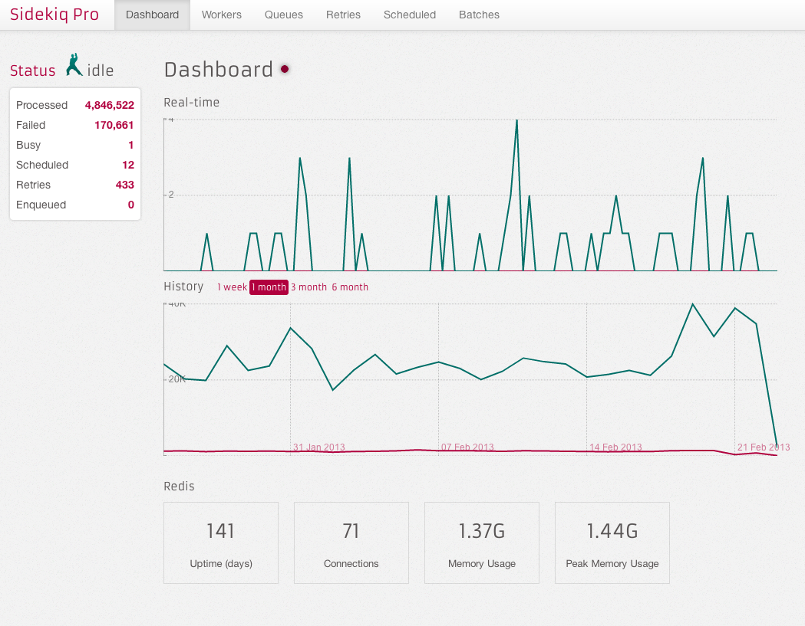

# Background Jobs

_by [Ryan Sobol](http://blog.ryansobol.com/code-fellows-background-jobs)_

In the last two chapters we added Email processing and File Uploading. Both of 
these tasks take significant in-process time on each request / response cycle.
We should process these jobs asynchrononously and do them via background jobs.

<iframe src="http://www.haikudeck.com/e/lJngFFV57n/?isUrlHashEnabled=false&isPreviewEnabled=false&isHeaderVisible=false" width="640" height="541" frameborder="0" marginheight="0" marginwidth="0"></iframe><br /><span style="font-family: arial, sans-serif; font-size: 8pt;">Created with <a href="http://www.haikudeck.com/p/lJngFFV57n/code-fellows-background-jobs?utm_campaign=embed&utm_source=webapp&utm_medium=text-link">Haiku Deck, the free presentation app</a></span>

```ruby
# product_mailer.rb
class ProductMailer < ActionMailer::Base
  default from: "notifications@example.com"

  def purchase_reminder(product_id)
    @product = Product.find(product_id)

    return if @product.paid?

    mail(
      :to      => @product.user.email,
      :subject => "Your product is about to expire!"
    )
  end
end>
```

```ruby
# purchases_controller.rb
class PurchasesController < ApplicationController
  def remind
    product_id = params[:product_id]

    # Possible slow external request!
    # ProductMailer.purchase_reminder(product_id).deliver

    PurchaseReminderJob.enqueue(product_id)
  end
end>
```

```ruby
# purchase_reminder_job.rb
class PurchaseReminderJob
  DEFAULTS = { queue: "mailers", priority: -10 }

  def initialize(product_id)
    @product_id = product_id
  end

  attr_reader :product_id

  def self.enqueue(product_id, options = {})
    job = new(product_id)

    Delayed::Job.enqueue(job, DEFAULTS.merge(options))
  end

  def perform
    mailer = ProductMailer.purchase_reminder(product_id)

    status = if mailer
      mailer.deliver
      "reminder sent"
    else
      "reminder not sent"
    end

    msg = "#{self.class}: product #{product_id} - #{status}"
    Rails.logger.info(msg)
  end
end
```

( from [Sidekiq](https://github.com/mperham/sidekiq) )

## Homework

* Review https://appcasts.io/blog/writing-your-first-background-worker 

* These railscasts may also be helpful:
    * http://railscasts.com/episodes/171-delayed-job
    * http://railscasts.com/episodes/271-resque
    * http://railscasts.com/episodes/366-sidekiq

* Pick one of the strategies used above.

So, remember all those great outoging mailers we made last week?  They need to
be called from a background job.

Same goes for any other external services you are using, for example REST HTTP
calls to other sites, or file uploads.

* Turn in the assignment by making a Pull Request to your Portfolio Site as usual, on a feature branch named appropriately. 
* Comment with "Done", a question or reflection, and let me know if you had collaborators.
